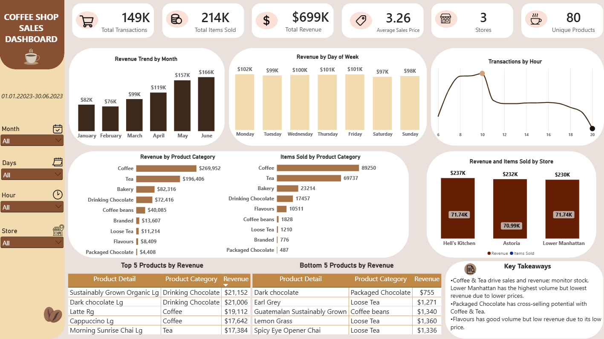

#  Coffee Shop Sales Analysis

## Project Overview

This project analyzes transactional sales data from a fictional coffee shop chain using **Microsoft Excel, Power Query, and Power BI**.

The purpose of the analysis is to evaluate sales performance across store locations, product categories, months, days of the week, and hours of the day. The project also identifies key business insights and potential opportunities to improve sales performance.

## Dataset Source

The dataset was originally provided by **Maven Analytics** as part of the **Coffee Shop Sales Challenge**.

The dataset represents transaction records from **Maven Roasters**, a fictional coffee shop operating across three locations in New York City.

## Tools Used

- Microsoft Excel
- Power Query
- Power BI
- Data Cleaning
- Exploratory Data Analysis
- Data Visualization
- Business Insight Generation

## Dataset Information

The dataset contains transaction-level sales data, including transaction details, product information, prices, quantities, store locations, and timestamps.

### Dataset Scope

- **Date range:** January 1, 2023 – June 30, 2023
- **Time range:** 6:00 AM – 8:59 PM
- **Number of transactions:** 149,116
- **Total items sold:** 214,470
- **Number of stores:** 3
- **Number of products:** 80

### Store Locations

- Astoria
- Hell's Kitchen
- Lower Manhattan

## Project Workflow

### 1. Data Preparation

The dataset was cleaned and prepared using Excel and Power Query.

The preparation process included:

- Checking and formatting data types
- Formatting date and time fields
- Calculating total revenue
- Creating month and day-of-week fields
- Extracting the hour from transaction time
- Preparing the dataset for analysis and visualization

### 2. Exploratory Data Analysis

The analysis focused on:

- Store performance
- Product category performance
- Monthly revenue and sales volume
- Revenue by day of the week
- Sales volume by day of the week
- Transaction activity by hour
- Top- and bottom-performing products

### 3. Dashboard Development

Two dashboard solutions were created:

- **Excel Dashboard**
- **Power BI Dashboard**

The dashboards present key performance indicators, sales trends, category comparisons, store performance, and time-based patterns.

## Key Findings

### Store Performance

- Hell's Kitchen generated the highest revenue.
- Lower Manhattan had the highest sales volume but the lowest average sales price.
- The three stores showed relatively similar sales volumes, indicating a consistent level of sales activity across locations.

### Product Category Performance

- Coffee generated the highest revenue and sales volume.
- Tea ranked second in both revenue and sales volume.
- Packaged Chocolate had the lowest revenue and sales volume.
- Coffee beans had the highest average sales price.
- Flavours generated relatively high sales volume but low revenue due to its low average sales price.

### Time-Based Performance

- Revenue and sales volume generally increased from January to June.
- February recorded the lowest revenue and sales volume.
- Transaction activity peaked around 10:00 AM and declined throughout the day.
- Revenue remained relatively stable across weekdays, with Monday and Friday showing slightly higher values.

## Business Recommendations

- Monitor Coffee and Tea stock availability, as they are the main revenue and sales volume drivers.
- Consider bundle promotions combining Packaged Chocolate with Coffee or Tea to increase cross-selling opportunities.
- Investigate the role of Flavours as an add-on product before making pricing decisions.
- Test afternoon and evening promotions to encourage sales during lower-traffic hours.
- Consider seasonal campaigns and promotional bundles during lower-performing months.

## Conclusion

This project transformed coffee shop transaction data into actionable business insights using Excel, Power Query, and Power BI.

The analysis showed that Coffee and Tea are the main revenue and sales volume drivers, while Packaged Chocolate presents a potential cross-selling opportunity through bundle promotions. Flavours generated relatively high sales volume but low revenue due to its low average sales price. At the store level, Hell's Kitchen generated the highest revenue, whereas Lower Manhattan had the highest sales volume.

The time-based analysis also revealed that sales generally increased from January to June and that transaction activity peaked around 10:00 AM. These findings can support business decisions related to inventory planning, product bundling, and targeted promotions during lower-traffic hours.

## Project Files

- `Coffee_Shop_Sales_Analysis_Excel.xlsx`
- `Coffee_Shop_Sales_Analysis_PBI.pbix`
- `Coffee_Shop_Sales_Analysis_Dashboard.png`

## Dashboard Preview

